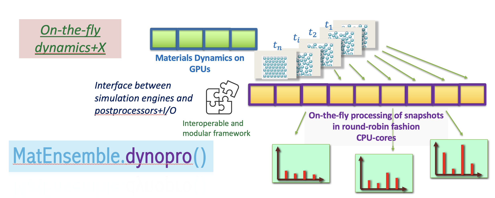

[](https://pypi.org/project/matensemble/)
[](https://matensemble.readthedocs.io/en/latest/)
[](https://www.python.org/downloads/)
[](https://opensource.org/licenses/BSD-3-Clause)

<p align="center">
  
</p>

# MatEnsemble

MatEnsemble is a Python library for **high-throughput workflows** on HPC systems. You define a directed acyclic graph (DAG) of chores—**Python callables** or **executable commands**—and MatEnsemble submits work through **[Flux](https://flux-framework.readthedocs.io/)**, tracks completions, **adapts** scheduling to free CPUs and GPUs, and writes structured logs and per-chore output directories.

An optional in-tree **dynopro** stack supports streaming dynamics and on-the-fly analysis for advanced materials simulation workflows.

## Features

- **DAG-based workflows** with dependencies via deferred return values (`OutputReference`)
- **Adaptive scheduling** that back-fills the allocation as chores finish (with a non-adaptive available)
- **Two chore types**: Python chores (remotely unpickled and executed by `matensemble.runtime_worker`) and argv-style **executable** chores
- **Resource requests**: tasks, cores per task, GPUs per task, optional MPI (`pmi2`) via Flux
- **Observability**: `status.json`, `matensemble_workflow.log`, per-chore `stdout` / `stderr`, pickle and JSON result artifacts; optional **web dashboard**

<p align="center">
  
</p>

<p align="center">
  
</p>


## Installation

OCI images are published to GitHub Container Registry

`ghcr.io/freddude2004/matensemble:baseline-vX.Y.Z`

See the [container packages](https://github.com/FredDude2004/MatEnsemble/pkgs/container/matensemble) and the [installation guide](https://matensemble.readthedocs.io/en/latest/installation.html) in the docs for Apptainer/Singularity and site-specific notes.

### Anaconda

You can build a Conda environment with MatEnsemble and dependencies installed using the environment.yaml file.

```bash
conda env create -f environment.yaml
```

## Example

```python
from matensemble.pipeline import Pipeline

pipe = Pipeline()
pipe.exec(command=["/bin/echo", "hello from MatEnsemble"])
pipe.submit()
```

For Python chores, dependency graphs, and the required split between an importable **chore module** and a **runner script**, see the [Tutorials](https://matensemble.readthedocs.io/en/latest/tutorials.html).

## Examples in the repository

Illustrative workflows live under [`example_workflows/`](https://github.com/FredDude2004/MatEnsemble/tree/main/example_workflows).

## Requirements and runtime

- A **Flux allocation** (or equivalent) on the machine where you call `Pipeline.submit()`
- For MPI Python or executable chores: a coherent MPI/Flux setup (e.g. PMI2) as expected by your site
- Optional: SSH port forwarding if you enable the dashboard on a compute node (see the design guide in the docs)

## Related links

- [Flux documentation](https://flux-framework.readthedocs.io/)
- [Flux Python guide](https://flux-framework.readthedocs.io/projects/flux-core/en/latest/guide/start.html)
- [Slurm documentation](https://slurm.schedmd.com/documentation.html) (common front-end to batch allocations)
- [LAMMPS manual](https://docs.lammps.org/Manual.html) (often used alongside ensemble MD workflows)

## Authors

Soumendu Bagchi, Kaleb Duchesneau (see `pyproject.toml` for contact details).

## License

BSD 3-Clause. See [`LICENSE`](LICENSE).
