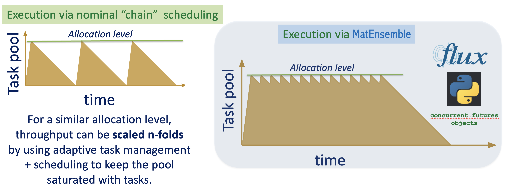

========
Overview
========

MatEnsemble is a framework to build, orchestrate, and asynchronously manage scalable **adaptive-learning**
workflows, especially targeted for compute-intensive AI-driven materials modeling simulations (e.g.,
atomistic modeling, Phase-Field, etc.) as efficiently as possible. Apart from standard automated
high-throughput computations, the core of MatEnsemble is designed to support "user-defined" acquisition
strategies to dynamically steer workflows based on intermediate results, which is a common pattern in active
learning and other autonomous workflows at scale. To enable scalable parametric sweeps and bypass standard
scheduler bottlenecks, typically encountered in leadership computing platforms, MatEnsemble uses a single
large allocation and an internal scheduler to manage arbitrarily large workloads. The library is built on top
of the Flux resource manager, and implements an efficient and **user-defined-strategy** based task orchestration
protocol, making it well-suited for high-throughput autonomous computing scenarios.

MatEnsemble [bagchi2025matensemble]_ benefits from the native Python executor interface of **Flux**
[ahn2020flux]_, and the concurrent asynchronous programming model of core Python through
``concurrent.futures`` objects [quinlan2009futures]_.

.. For streaming dynamics workflows, the in-tree **dynopro** components use an in-memory analysis protocol for
.. post-processing large atomistic trajectories on heterogeneous GPU+CPU systems via MPI communicator splitting
.. (cf. [bagchi2025matensemble]_).

High-throughput orchestration and schedulers
============================================

The library targets **high-throughput** and **ensemble** scenarios: thousands of short bursts of simulations,
parameter sweeps, or analysis pipelines where classic "one Slurm job per task" workflows would overwhelm the
scheduler or spend too much time queued. In the context of high-throughput materials modeling, fully leveraging
exascale resource capabilities with SLURM or similar schedulers is challenging due to:

* Many short ``sbatch`` / ``srun`` invocations increasing scheduler load and log volume.
* Queue latency dominating when tasks are tiny relative to scheduler quanta.
* Some centers capping how many job steps may be launched inside a single allocation.
* Significant throughput loss due to idle resources and lack of fine-grained task management.

A common mitigation is **one large allocation** plus an **internal scheduler** that launches many child
processes or MPI ranks inside that allocation. The remaining problem is **utilization**: if work is launched
in static waves, fast tasks finish early and cores sit idle while slow tasks run. MatEnsemble addresses this
with its **adaptive** task orchestration capability: new or pending tasks are launched as soon as resources
free up, keeping the allocation saturated until all work is done.

What MatEnsemble does
=====================

MatEnsemble continuously: (1) tracks available computing resources, (2) submits ready DAG nodes to the queue,
(3) processes completed Flux jobs, (4) unblocks dependents, and (5) repeats until no ready, running, or blocked
work remains. User-defined strategies can also spawn additional DAG work based on intermediate results.

See :doc:`design` for the exact loop, artifacts, and environment assumptions.

Core concepts
=============

:class:`~matensemble.pipeline.Pipeline`
    User-facing builder. Python functions decorated with :meth:`~matensemble.pipeline.Pipeline.chore` turn into
    delayed function calls; :meth:`~matensemble.pipeline.Pipeline.exec` adds argv-style work.

:class:`~matensemble.model.OutputReference`
    Placeholder returned from a delayed function call. Passing it into another chore encodes a **dependency edge**
    and ensures upstream results are unpickled before the downstream function runs.

:class:`~matensemble.chore.Chore`
    Single Flux submission record: command, resources, working directory, and for Python chores, the qualified
    name of the function you want to call.

:class:`~matensemble.manager.FluxManager`
    Runtime coordinator created when :meth:`~matensemble.pipeline.Pipeline.submit` is called.

:class:`~matensemble.strategy.FutureProcessingStrategy`
    Pluggable completion handler. Built-ins: :class:`~matensemble.strategy.AdaptiveStrategy` (fill idle
    resources as tasks finish) and :class:`~matensemble.strategy.NonAdaptiveStrategy` (wave-style drain).

Logging and on-disk layout
==========================

Every run creates a **timestamped workflow directory** under your chosen base path (by default the current
working directory):

.. code-block:: text

   <base>/
   └── matensemble_workflow-YYYYMMDD_HHMMSS/
       ├── status.json              # atomically updated for the dashboard / monitoring
       ├── matensemble_workflow.log # detailed text log from the ``matensemble`` logger
       └── out/
           ├── registry/            # serialized chore callables
           │   ├── Callable name
           │   ├── Callable name
           │   └── ...
           └── <chore_id>/
               ├── stdout
               ├── stderr
               ├── chore.pickle     # serialized chore object
               ├── metadata.json    # metadata of the chore in JSON for debugging
               └── result.pickle    # serialized Python chore return value

The driver prints a short hint to stderr with absolute paths to ``status.json``, the log file, and the ``out``
tree when logging initializes.

Adaptive vs. non-adaptive scheduling
=====================================

In **adaptive** mode (the default), completing a chore can **immediately** trigger more submissions in the same
super-loop iteration via :meth:`~matensemble.manager.FluxManager._submit_until_ooresources`, keeping the
allocation saturated when a backlog exists.

In **non-adaptive** mode, the manager only submits during the initial "fill until out of resources" phases;
completion handling updates the DAG but **does not** proactively pull additional ready chores until the next
outer-loop scheduling opportunity: use this when tighter control or simpler resource snapshots are desired.

.. image:: ../../media/chain_v_adaptive_scheduling.png
   :alt: Diagram contrasting static batching with adaptive back-filling of tasks

User-defined strategies
=======================

MatEnsemble uses the *strategy pattern* when processing :class:`flux.job.FluxExecutorFuture` completions.
Users can define their own strategies and inject them into the processing loop. For example, a strategy can
inspect the result of a completed :class:`~matensemble.chore.Chore`, create one or more new
:class:`~matensemble.chore.ChoreSpec` objects, and add those chores to the submission queue while the workflow
is still running.

Here is an example of adding a strategy to a chore:

.. code-block:: python

    import random

    from matensemble.chore import ChoreSpec
    from matensemble.model import Resources
    from matensemble.pipeline import Pipeline

    pipe = Pipeline()

    @pipe.chore()
    def generate_num():
        return random.randint(1, 1000)

    @pipe.chore()
    def fizz(n):
        print(f"{n} is divisible by 3")
        print("fizz")

    @pipe.chore()
    def buzz(n):
        print(f"{n} is divisible by 5")
        print("buzz")

    @pipe.chore()
    def fizzbuzz(n):
        print(f"{n} is divisible by 3 and 5")
        print("fizzbuzz")

    @pipe.strategy(bolo_list=["generate_num"])
    def proc_strat(results_of_finished_chore):
        if results_of_finished_chore % 15 == 0:
            return ChoreSpec(
                args=(results_of_finished_chore,),
                kwargs=None,
                resources=Resources(),
                qualname="fizzbuzz",
            )
        if results_of_finished_chore % 5 == 0:
            return ChoreSpec(
                args=(results_of_finished_chore,),
                kwargs=None,
                resources=Resources(),
                qualname="buzz",
            )
        if results_of_finished_chore % 3 == 0:
            return ChoreSpec(
                args=(results_of_finished_chore,),
                kwargs=None,
                resources=Resources(),
                qualname="fizz",
            )
        print(f"{results_of_finished_chore} is not divisible by 3 or 5")

    for _ in range(10):
        generate_num()

    pipe.submit()

The :obj:`bolo_list` tells the manager which chores it should be on the lookout for. Whenever the manager sees a
``generate_num`` chore instance complete, it can spawn the user-defined strategy as a new chore. This strategy can
optionally return a :obj:`matensemble.chore.ChoreSpec`, which will spawn a new chore with the specified args,
kwargs, and resources (cores, GPUs, MPI, etc.).

Roadmap and stability
=====================

.. note::

   The project is under active development; pre-1.0 APIs may still move. Track ``CHANGELOG`` / release notes
   in the repository for breaking changes. The internal **dynopro** package (streaming dynamics and heavy
   analysis) ships in-tree but is not yet part of the curated Sphinx API toctree.

**Checkpointing:** ``write_restart_freq`` exists on :meth:`~matensemble.pipeline.Pipeline.submit`, but
checkpoint serialization is **not yet implemented**. Long production runs should pass ``None`` until
restart files are supported (:doc:`reference`).

References
==========

.. [ahn2020flux] Ahn, D. H., Bass, N., Chu, A., Garlick, J., Grondona, M., Herbein, S.,
   Ingolfsson, H. I., Koning, J., Patki, T., Scogland, T. R. W., Springmeyer, B.,
   and Taufer, M. (2020). "Flux: Overcoming scheduling challenges for exascale workflows."
   *Future Generation Computer Systems*, 110, 202-213. https://doi.org/10.1016/j.future.2020.04.006

.. [quinlan2009futures] Quinlan, B. (2009). "PEP 3148 -- futures - execute computations
   asynchronously." Python Enhancement Proposals. https://peps.python.org/pep-3148/

.. [bagchi2025matensemble] Bagchi, S., Biswas, A., Balachandran, P. V., Ghosh, A.,
   and Ganesh, P. (2025). "Towards 'on-demand' van der Waals epitaxy with an adaptive
   resource-driven online ensemble sampling simulation framework." arXiv:2504.05539.
   https://doi.org/10.48550/arXiv.2504.05539

Next steps
==========

* :doc:`installation` — containers, PyPI install, site-specific shell snippets.
* :doc:`tutorials` — minimal Python and executable examples, dependency graphs, packaging tips.
* :doc:`design` — Flux interactions, ``PYTHONPATH``, failure propagation, dashboard tunneling.
* :doc:`reference` — exhaustive parameter and artifact listing.
* :ref:`api-reference` — docstring-generated module documentation.
