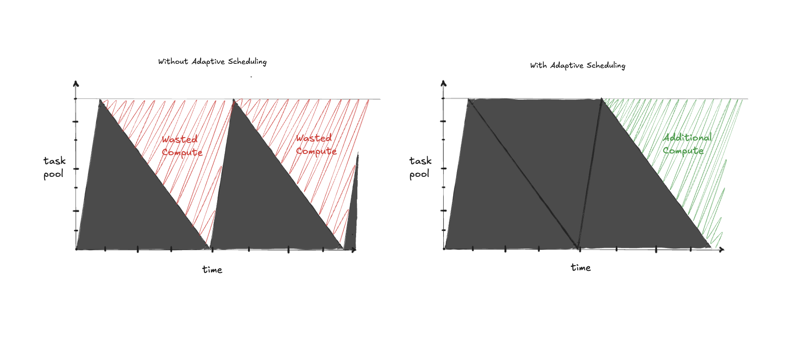
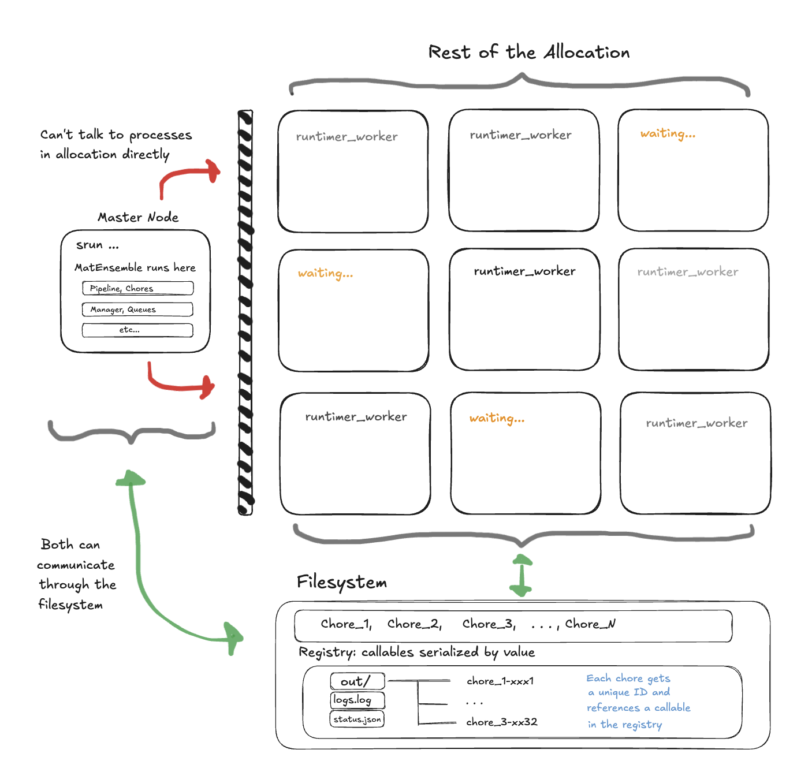
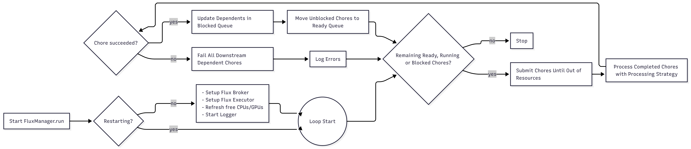
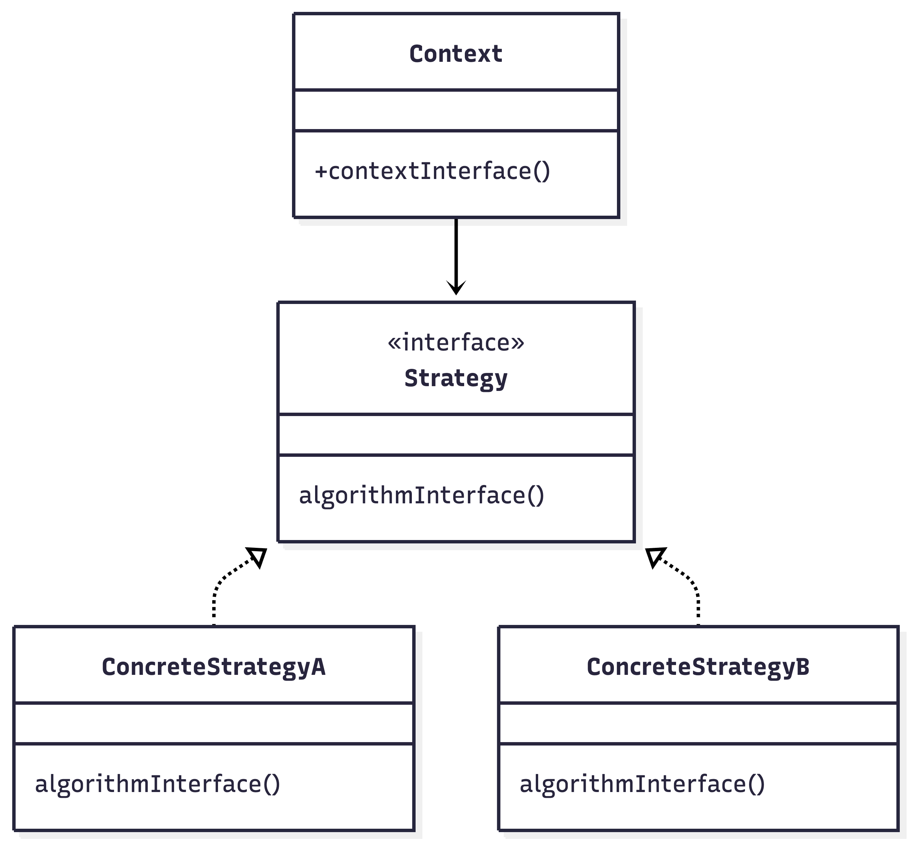

### Summary

MatEnsemble is a Python package for defining and running high-throughput workflows inside high-performance computing (HPC) allocations. Users construct a directed acyclic graph (DAG) of *chores*, where each chore is either a delayed python function call or an executable command, each with explicit resource requirements. MatEnsemble submits these chores through the Flux resource manager, tracks completion, resolves dependencies through serialized results, and records workflow state in a structured layout. The package is designed for <insert science cases here> where launching one batch job per task would create excessive scheduler overhead or leave resources idle.

The main user interface is the `Pipeline` object. Decorated Python functions become delayed calls that return `OutputReference` placeholders, passing those placeholders into later chores creates dependency edges. Executable chores can also be added for external programs. At submission time, MatEnsemble validates the dependency graph, submits ready chores that fit the available resources, and continues scheduling until the workflow has no ready, running, or blocked chores. Each run writes logs, standard output and error files for each chore, chore metadata, Python return values, and a status file that can optionally drive a lightweight dashboard.

### Statement of need

<!-- ==================================================================================================================================================================================== -->
Modern materials science workloads increasingly consist of large ensembles of related simulations rather than a single monolithic calculation. Examples include <INSERT YOUR USE CASES HERE> These workloads may require thousands or even millions of relatively small tasks whose execution patterns are difficult to express efficiently using traditional batch schedulers.

Submitting large numbers of short-lived jobs directly to a system scheduler such as Slurm can create significant scheduling overhead, increase queue wait times, and place unnecessary load on shared scheduling infrastructure. For this reason some systems restrict the number of invocations of certain commands to reduce the strain that could be placed on the scheduler. On the other hand, grouping work into batches within a single allocation often leads to poor utilization, as fast-running tasks complete early and leave resources idle while longer-running tasks continue to execute. Researchers need a mechanism that can efficiently manage large collections of heterogeneous tasks while maintaining high utilization of expensive HPC resources.

MatEnsemble addresses these challenges by combining a Python-native workflow interface with the Flux resource manager. Rather than submitting thousands of independent scheduler jobs, users acquire a single allocation and allow MatEnsemble to manage task execution within a user-space Flux instance. This hierarchical scheduling model dramatically reduces scheduler overhead while enabling fine-grained control over task placement and execution. MatEnsemble continuously monitors available resources and adaptively backfills newly eligible tasks as running work completes, maintaining high utilization even when task runtimes vary significantly.



Unlike many existing scientific workflow systems that rely on external databases, centralized services, or privileged scheduler interactions, MatEnsemble is designed as a lightweight Python library that operates entirely within the user's allocation. Workflows are expressed as directed acyclic graphs of Python callables or executable tasks, with declarative resource requirements attached to each task. The framework leverages Flux's scalable user-space scheduling architecture while exposing a familiar Python programming model for workflow construction and execution.

A distinguishing feature of MatEnsemble is its support for user-defined scheduling strategies. In addition to the built-in adaptive scheduler, users may inject custom workflow logic capable of dynamically generating new tasks during execution based on intermediate results. This enables the construction of dynamically expanding scientific workflows and active-learning loops.

The target users are computational scientists and HPC developers who need to compose ensembles of Python functions, MPI programs, shell commands, and analysis steps without writing a custom scheduler. The package also targets research software developers who want a lightweight execution layer for Flux-enabled systems while retaining human readable files for debugging and reproducibility.
<!-- ==================================================================================================================================================================================== -->

### State of the field

Several mature Python workflow systems already support scientific task graphs. Parsl provides a broad parallel scripting model for Python functions and external applications across local, cluster, cloud, and grid resources [@babuji2019parsl; @parsl_docs]. Jobflow provides a Pythonic decorator-based workflow model aimed at high-throughput computational workflows, with strong adoption in materials science [@rosen2024jobflow]. libEnsemble focuses on dynamic ensembles using a generator-simulator-allocator model, particularly for adaptive sampling and optimization campaigns [@hudson2025libensemble]. These systems demonstrate the value of Python-native workflows for computational science, and MatEnsemble is complementary rather than a replacement.

### Software design

MatEnsemble’s architecture is centered on a separation between workflow definition, scheduling, execution. The user process constructs a graph of delayed chores through the Pipeline API, while FluxManager owns runtime state such as blocked, ready, running, completed, and failed chore sets. Individual chores are submitted through Flux as independent jobs. For Python chores, this separation creates a reconstruction problem. Callables defined in the user’s Python process are not available by memory reference inside a fresh worker process launched by Flux.



MatEnsemble solves this by writing callable registry entries and per-chore specifications into the workflow directory, allowing runtime_worker to reload the chore, resolve dependency outputs, execute the callable, and write a result artifact for downstream chores.

<!-- technical contributions: -->
<!---->
<!-- * Flux-native adaptive back-filling rather than static waves of jobs. -->
<!-- * Pythonic DAG construction using delayed functions and OutputReference. -->
<!-- * Remote Python chore reconstruction through registry + per-chore artifacts. -->
<!-- * Strategy-pattern completion handling that makes adaptive, non-adaptive, and user-defined behavior interchangeable. -->
<!-- * Dynamic workflow expansion through UserStrategy and ChoreSpec, which is the most novel architecture idea. -->

During workflow construction, Pipeline.chore records Python function calls and Pipeline.exec records executable commands instead of running them immediately. When one chore uses the output of another, MatEnsemble automatically detects this relationship and creates a dependency link between the two tasks. Before execution begins, MatEnsemble builds a directed acyclic graph (DAG) representing the workflow, verifies that all dependencies are valid, and topologically sorts the graph to determine a safe execution order.

For Python chores, the original function definitions are serialized into a centralized *registry* so they can be deserialized and executed later on remote compute nodes. MatEnsemble also creates a dedicated directory for each chore to store outputs, logs, metadata, and results. When the workflow is launched, a workflow directory is created that contains all of the files needed to execute, monitor, and debug the workflow.

```
   <basedir or cwd>/
   └── matensemble_workflow-YYYYMMDD_HHMMSS/
       ├── status.json              # Atomically updated for the dashboard / monitoring
       ├── matensemble_workflow.log # Detailed text log from the logger
       └── out/
           ├── registry/            # Pickled chore callables
           │   ├── func_qualname_1
           │   ├── ...
           │   └── func_qualname_n
           ├── <chore_id_1>/
           │   ├── stdout
           │   ├── stderr
           │   ├── metadata.json    # Metadata of the chore in JSON for debugging
           │   ├── chore.pickle     # Pickled chore object
           │   └── result.pickle    # Python chore return value
           ├── ...
           └── <chore_id_n>/
               └── ...
```

At runtime, `FluxManager` owns the ready, blocked, running, completed, and failed chore sets. It obtains a Flux handle, measures currently free cores and GPUs, and repeatedly executes a scheduling loop: refresh resources, write status, submit every ready chore that fits, process completed Flux futures, unblock downstream chores, and repeat. Python chores are launched through `matensemble.runtime_worker`, which reloads a serialized chore specification, loads the registered function, and loads upstream results, substitutes them for `OutputReference` placeholders, executes the function, and writes the return value to `result.pickle`. This architecture trades some serialization overhead for a clear boundary between the driver and worker processes, making each chore's command, metadata, stdout, stderr, and result inspectable on disk.



The scheduler uses the *strategy pattern* for future processing. The Strategy Pattern is a behavioral software design pattern that defines a family of algorithms, encapsulates each one in a separate class, and makes them interchangeable at runtime.



The default adaptive strategy attempts to submit newly unblocked tasks immediately as resources become available, while the non-adaptive strategy follows a simpler wave-based execution model. Users may also inject custom scheduling strategies into the FluxManager at runtime. A user-defined strategy looks at completed chores and if they are on in a list of chores to Be On the Look-Out (BOLO) for it will spawn the callback chore and can inspect the results of a completed Python chore and return a ChoreSpec describing additional work to be performed. MatEnsemble then dynamically adds the new chore to the workflow and schedules it when its dependencies are satisfied. This allows workflows to expand during execution based on intermediate results, enabling adaptive and data-driven computational campaigns.


<!-- # Research impact -->

<>

### AI usage disclosure

This software and paper was prepared with assistance from many models including Microsoft's Copilot, Anthropic's Claude Sonnet 4.6 and OpenAI's ChatGPT 5.4 & 5.5. The models were used in the initial refactor though the first lines of code were handwritten to establish a structure and design pattern that best fit the scope of the project. After the initial skeleton was established many methods were used to take advantage of the power of these models while ensuring consistency. Methods such as "Spec Driven Development" and "Rubber Duck Debugging". All of the generated code was thoroughly and tests were written to define behavior.

### Acknowledgements

<!-- TODO: Acknowledge funding sources, institutional support, HPC allocations, mentors, and contributors.  -->

### References

[Flux Documentation](https://flux-framework.readthedocs.io/en/latest/)
[JobFlow](https://matgenix.github.io/jobflow-remote/index.html)
[Parsl](https://parsl-project.org/)
[libEnsemble](https://libensemble.readthedocs.io/en/latest/)
<!-- TODO: ADD other sources that were used  -->
