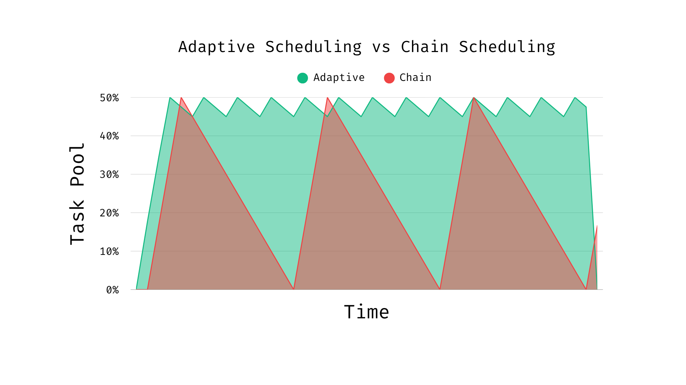

## Summary

MatEnsemble is a Python package for defining and running high-throughput workflows on High-Performance Computing (HPC) systems. Users construct a Directed Acyclic Graph (DAG) of *chores*, where each chore is either a delayed python function call or an executable command, each with explicit resource requirements. MatEnsemble submits these chores through the Flux resource manager, tracks completion, resolves dependencies through serialized results, and records workflow state in a structured layout. The package is designed for...

# <INSERT SCIENCE CASES HERE>

where launching one batch job per task would create excessive scheduler overhead or leave resources idle.

## Statement of need

<!-- ==================================================================================================================================================================================== -->
Modern materials science workloads increasingly consist of large ensembles of related simulations rather than a single monolithic calculation. Examples include

# <INSERT YOUR USE CASES HERE>

These workloads may require thousands or even millions of relatively small tasks whose execution patterns are difficult to express efficiently using traditional batch schedulers.

Submitting large numbers of short-lived jobs directly to a system scheduler such as SLURM can create significant scheduling overhead, increase queue wait times, and place unnecessary load on shared scheduling infrastructure. For this reason some systems restrict the number of invocations of certain commands to reduce the strain that could be placed on the scheduler. On the other hand, grouping work into batches within a single allocation often leads to poor utilization, as fast-running tasks complete early and leave resources idle while longer-running tasks continue to execute. Researchers need a mechanism that can efficiently manage large collections of heterogeneous tasks while maintaining high utilization of expensive HPC resources.

MatEnsemble addresses these challenges by combining a Python-native workflow interface with the Flux resource manager. Rather than submitting thousands of independent scheduler jobs, users acquire a single allocation and allow MatEnsemble to manage task execution within a user-space Flux instance. This hierarchical scheduling model dramatically reduces scheduler overhead while enabling fine-grained control over task placement and execution. MatEnsemble continuously monitors available resources and adaptively backfills newly eligible tasks as running work completes, maintaining high utilization even when task runtimes vary significantly.



Workflows may consist of Python functions, MPI applications, shell commands, or combinations thereof. For example, a user may define an MPI-enabled chore that launches multiple ranks through Flux while still participating in the same dependency-aware workflow:

```python
from matensemble.pipeline import Pipeline
from mpi4py import MPI

pipe = Pipeline()

@pipe.chore(num_tasks=10, cores_per_task=1, mpi=True)
def mpi_helloworld():
    size = MPI.COMM_WORLD.Get_size()
    rank = MPI.COMM_WORLD.Get_rank()
    name = MPI.Get_processor_name()

    print(f"Hello World! I am process {rank} of {size} on {name}.")

for _ in range(10):
    mpi_helloworld()

pipe.submit()
```

Each invocation becomes an independent Flux job while remaining under the control of the workflow manager and sharing the same allocation.

Unlike many existing scientific workflow systems that rely on external databases, centralized services, or privileged scheduler interactions, MatEnsemble is designed as a lightweight Python library that operates entirely within the user's allocation. Workflows are expressed as DAG of Python callables or executable tasks, with declarative resource requirements attached to each task. The framework leverages Flux's scalable user-space scheduling architecture while exposing a familiar Python programming model for workflow construction and execution.

A distinguishing feature of MatEnsemble is its support for user-defined scheduling strategies. In addition to the built-in adaptive scheduler, users may inject custom workflow logic capable of dynamically generating new tasks during execution based on intermediate results. This enables the construction of dynamically expanding scientific workflows and active-learning loops.

The target users are computational scientists and HPC developers who need to compose ensembles of Python functions, MPI programs, shell commands, and analysis steps without writing a custom scheduler. The package also targets research software developers who want a lightweight execution layer for Flux-enabled systems while retaining human readable files for debugging and reproducibility.
<!-- ==================================================================================================================================================================================== -->

## State of the field

Several mature Python workflow systems already support scientific task graphs. Parsl provides a broad parallel scripting model for Python functions and external applications across local, cluster, cloud, and grid resources [@babuji2019parsl; @parsl_docs]. Jobflow provides a Pythonic decorator-based workflow model aimed at high-throughput computational workflows, with strong adoption in materials science [@rosen2024jobflow]. libEnsemble focuses on dynamic ensembles using a generator-simulator-allocator model, particularly for adaptive sampling and optimization campaigns [@hudson2025libensemble]. These systems demonstrate the value of Python-native workflows for computational science, and MatEnsemble is complementary rather than a replacement.

## Example workflow

The primary user interface in MatEnsemble is the `Pipeline` object. Python functions decorated with `@matensemble.pipeline.Pipeline.chore()` become delayed function calls that return `OutputReference` objects rather than executing immediately. These references can be passed into later chores, allowing MatEnsemble to infer dependencies automatically and construct a DAG. The example below computes the factorial of 100 and then computes the digit sum of the resulting value. The dependency between the two chores is inferred from the `OutputReference` returned by the first call.

```python
from matensemble.pipeline import Pipeline

pipe = Pipeline()

@pipe.chore()
def factorial(n):
    result = 1
    for i in range(2, n + 1):
        result *= i
    return result

@pipe.chore()
def digit_sum(n):
    return sum(int(x) for x in str(n))

a = factorial(100)
b = digit_sum(a)

pipe.submit()
```

Internally, MatEnsemble transforms workflows such as this into a DAG of chores, validates dependencies, serializes the workflow state, and executes eligible tasks through Flux as resources become available.


## Software design

MatEnsemble separates workflow definition, scheduling, and execution into distinct components. Users construct workflows through the Pipeline API, which records delayed chores and dependency relationships. During submission, the workflow is validated, serialized, and handed to a FluxManager instance that coordinates execution through Flux.


MatEnsemble’s architecture is centered on a separation between workflow definition, scheduling, and execution. The user process constructs a graph of delayed chores through the `Pipeline` API, while `FluxManager` owns runtime state such as blocked, ready, running, completed, and failed chore sets. Individual chores are submitted through Flux as independent jobs. For Python chores, this separation creates a reconstruction problem. Callables defined in the user’s Python process are not available by memory reference inside a fresh worker process launched by Flux.


MatEnsemble solves this by creating a registry where functions are serialized and stored by value. Each call to one of these registered functions then creates a specification that is placed into the output directory of the respective chore. MatEnsemble is then able to submit an internal module, `matensemble.runtime_worker`, as a Flux job which will reload the chore, resolve dependency outputs, execute the callable, and write a result artifact for downstream chores.

During workflow construction, `matensemble.pipeline.Pipeline.chore` records Python function calls and `matensemble.pipeline.Pipeline.exec` records executable commands. When one chore uses the output of another, MatEnsemble automatically detects this relationship and creates a dependency link between the two chores. Before execution begins, MatEnsemble builds a DAG representing the workflow, verifies that all dependencies are valid, and topologically sorts the graph to determine the correct execution order.

At runtime, MatEnsemble creates a dedicated directory for each chore to store outputs, logs, metadata, and results. The chore object itself is also serialized to allow the arguments to a function call be any python object rather than restricting it to JSON serializable objects. When the workflow is launched, a workflow directory is created that contains all of the files needed to execute, monitor, and debug the workflow.

```
   <basedir or cwd>/
   └── matensemble_workflow-YYYYMMDD_HHMMSS/
       ├── status.json              # Atomically updated for the dashboard / monitoring
       ├── matensemble_workflow.log # Detailed text log from the logger
       └── out/
           ├── registry/            # Pickled chore callables
           │   ├── func_qualname_1
           │   ├── ...
           │   └── func_qualname_n
           ├── <chore_id_1>/
           │   ├── stdout
           │   ├── stderr
           │   ├── metadata.json    # Metadata of the chore in JSON for debugging
           │   ├── chore.pickle     # Pickled chore object
           │   └── result.pickle    # Python chore return value
           ├── ...
           └── <chore_id_n>/
               └── ...
```

At runtime, `FluxManager` owns the ready, blocked, running, completed, and failed chore sets. The manager continuously monitors resource availability, submits ready chores that fit within the allocation, processes completed tasks, updates dependency information, and unblocks newly eligible work. This scheduling loop continues until no ready, running, or blocked chores remain.


The scheduler uses the *strategy pattern* to separate completion handling logic from the core scheduling loop. A strategy determines how completed chores are processed and how newly available work is admitted into the workflow.


The default adaptive strategy attempts to submit newly unblocked chores immediately as resources become available, helping maintain high utilization within a running allocation. The non-adaptive strategy provides a simpler wave-based execution model in which newly eligible chores are submitted during the next scheduling cycle.

MatEnsemble also supports user-defined strategies. These strategies can inspect the results of completed Python chores and dynamically generate additional work during execution. This capability enables adaptive parameter searches, active-learning workflows, iterative optimization campaigns, and other data-driven scientific applications where the total amount of work is not known in advance.

### Dynamic workflow expansion

User-defined strategies allow workflows to expand dynamically during runtime. A strategy may inspect the result of a completed chore and return a `matensemble.chore.ChoreSpec` describing new work to be added to the workflow. The new chore is validated, inserted into the dependency graph, and scheduled like any other task.

The example below implements a simple binary search. Each completed `guess` chore produces a result that is examined by a user-defined strategy. To attach chores to a strategy by adding their name to the `BOLO List`. This will tell the manager to Be On the Look-Out (BOLO) for this chore, if it sees it then it will spawn the strategy and pass the results from the chore to the strategy. Based on that result, the strategy generates another `guess` chore until the target value is found.

```python
@pipe.chore()
def guess(lower: int, upper: int, guess_num: int = 1) -> dict:
    return {
        "guess": ((lower + upper) // 2),
        "low": lower,
        "high": upper,
        "num_guesses": guess_num,
    }


answer = random.randint(1, 100)
bolo_list = ["guess"]


@pipe.strategy(bolo_list=bolo_list)
def higher_or_lower(guess_result, ans=answer):

    if guess_result["guess"] == ans:
        print(
            f"Good Job! I was thinking of {ans}, "
            f"and you got it in {guess_result['num_guesses']}"
        )

    elif guess_result["guess"] < ans:
        return ChoreSpec(
            args=(
                guess_result["guess"] + 1,
                guess_result["high"],
                guess_result["num_guesses"] + 1,
            ),
            kwargs=None,
            resources=Resources(),
            qualname="guess",
        )

    else:
        return ChoreSpec(
            args=(
                guess_result["low"],
                guess_result["guess"] - 1,
                guess_result["num_guesses"] + 1,
            ),
            kwargs=None,
            resources=Resources(),
            qualname="guess",
        )
```

This mechanism allows MatEnsemble workflows to adapt their execution path based on intermediate results rather than requiring the entire workflow graph to be known before execution begins.

## Research impact

# <PUT RESEARCH IMPACT HERE>

## AI usage disclosure

The package and wrapping API design are that of the author's and are the result of incremental development and testing. However, generative AI tools have been used during development: 1) Microsoft Copilot integration in GitHub Pull Requests has been used for code reviews to ensure correctness and catch any extra bugs; 2) OpenAI's ChatGPT 5.4 & 5.5 has been used for "rubber duck debugging", general debugging, and for limited generation of boilerplate code, some tests and documentation. After the initial skeleton was established by the author's many methods were used to take advantage of the power of these models while ensuring consistency. Methods such as "Spec Driven Development" and "Rubber Duck Debugging". No AI generated content has been accepted without review and testing, nor does it constitute the majority of the work produced. For this paper, ChatGPT was used to suggest edits for clarity and structure, but was not used to generate the contents or sections, nor were the suggestions implemented wholesale.

## Acknowledgements

<!-- TODO: Acknowledge funding sources, institutional support, HPC allocations, mentors, and contributors.  -->

## References

[Flux Documentation](https://flux-framework.readthedocs.io/en/latest/)
[JobFlow](https://matgenix.github.io/jobflow-remote/index.html)
[Parsl](https://parsl-project.org/)
[libEnsemble](https://libensemble.readthedocs.io/en/latest/)
<!-- TODO: ADD other sources that were used  -->
